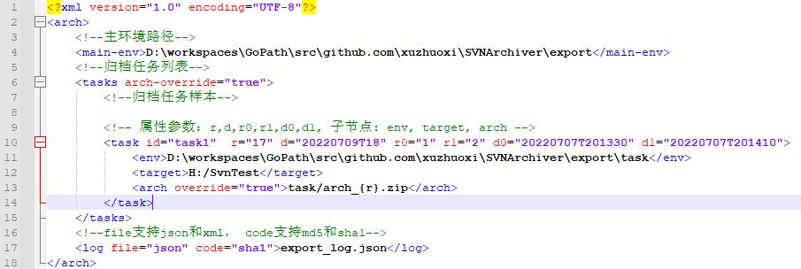

# SVNArchiver
SVN Archive tool.  

[中文](README.md) | English  

## <span id="a1">Compatibility</span>
go 1.24  

## <span id="a2">Start</span>

### <span id="a2.1">2.1 Download</span>
+ Download releases [here](https://github.com/xuzhuoxi/SVNArchiver/releases).  
+ Clone the repository:  
```sh
  git clone https://github.com/xuzhuoxi/SVNArchiver.git
```

### <span id="a2.2">2.2 Build</span>
+ Requires [Go 1.24+](https://go.dev/dl/) with Go modules enabled. The main package is `./src`.  
+ Local cross-compile (unit tests, multi-platform binaries, and source archive):  
  + Windows: [build/build.bat](/build/build.bat)  
  + Linux / macOS: [build/build.sh](/build/build.sh)  
+ You can also build with [goxc](https://github.com/laher/goxc):  
  + Windows: [build/goxc_build.bat](/build/goxc_build.bat)  
  + Linux: [build/goxc_build.sh](/build/goxc_build.sh)  
  + Modify those scripts for a custom build if needed. Tool documentation: [goxc](https://github.com/laher/goxc).  
+ Build for the current platform only:  
```sh
  go build -o SVNArchiver ./src
```
+ Pushing a `v*.*.*` tag on `main` triggers the [Release](/.github/workflows/Release.yml) workflow to cross-compile and publish. See [Release.md](/.github/workflows/Release.md).  

### <span id="a2.3">2.3 Run</span>
+ The running machine requires the Subversion **command-line** client (`svn` and `svnversion` both on PATH). See [3.3 Note](#a3.3).  
+ only supports command line operation  
+ Reference command:  
  + Query and submit information function:  
  + [Query submission information](#a3.2.1)  
      `SVNArchiver -size=50 -target=Svn directory`  
  + Full archive functionality:  
    + [full archive of version numbers](#a3.2.2)  
      `SVNArchiver -env=environment_path -r=12 -target=relative Svn directory relative to environment_path -arch=archive_path_{d}_{r}.zip`  
    + [full archive of time points](#a3.2.3)  
      `SVNArchiver -d=20060102T150405 -target=Svn directory -arch=archive file path_{d}_{r}.zip`  
  + Difference archive function:  
    + [version number difference archive](#a3.2.4)  
      `SVNArchiver -env=environment_path -r0=1 -r1=15 -target=relative Svn directory relative to environment_path -arch=archive_path_{d0}_{d1}_{r0}_{r1}.zip `  
    + [point-in-time difference filing](#a3.2.5)  
      `SVNArchiver -d0=20220703 -d1=20220709T150405 -target=Svn directory -arch=archive_path_{d0}_{d1}_{r0}_{r1}.zip`  
  + File according to configuration xml:  
     + [Configuration file batch archive](#a3.2.6)  
       `SVNArchiver -xml=config xml file path`  

## <span id="a3">User Manual<span>

### <span id="a3.1">3.1 Parameter description<span>

+ <span id="a3.1.1">-env<span>  
Environment path, used to specify a base path, overriding the directory of the executable "SVNArchiver", then -target and -arch can use relative paths.  
If not specified, the directory where the executable file is located is used as the environment path.  

+ <span id="a3.1.2">-xml<span>  
Configuration file path for batch tasks.  

+ <span id="a3.1.3">-size<span>  
The maximum number of query items displayed, requires >=0, when the value is 0, it is considered as unlimited.  

+ <span id="a3.1.4">-target<span>  
The svn directory for archive processing, which can be the **non-root directory** of the svn repository.  

+ <span id="a3.1.5">-arch<span>  
Archive file save path, supports [wildcard](#a3.1.12).  

+ <span id="a3.1.6">-r<span>  
Used when archiving completely, to specify a specific version number, and use that version number (or the most recent version number onwards) for archiving.  

+ <span id="a3.1.7">-d<span>  
Used when archiving completely, to specify a point in time and use the version number at that point in time (or the most recent version number onwards) for archiving.  

+ <span id="a3.1.8">-r0<span>  
Used in differential archiving to specify the starting version number.  

+ <span id="a3.1.9">-r1<span>  
Used when diffing archives, to specify the ending version number.  

+ <span id="a3.1.10">-d0<span>  
Used in differential archiving to specify the start time.  

+ <span id="a3.1.11">-d1<span>  
Used in differential archiving to specify the end time.  

+ <span id="a3.1.12">**NOTE**<span>:  
  1. The version number is specified **requires confirmation**, if the svn directory is **non-consecutive version number** and there is no specified version number, use the **forward most recent** version number instead.  
  2. Time designation **not required to be determined**, the final use is the current time or the latest version number.  
  3. When using the version number configuration for differential archiving, at least one of -r0 and -r1 is required. When only -r0 is present, -r1 will be set to the **largest version number**. When there is only -r1, -r0 is all set to the **previous version number** **relative to -r1**.  
  4. When using time configuration for differential archiving, at least one of -d0 and -d1 is required. When only -d0 is present, -d1 will be set to the latest time. When there is only -d1, -d0 will be set to the **previous version number time** relative to the version number associated with -d1.  
  5. Parameters with "r" and "d" should not be used together.  
  6. -arch can use a fixed path or a wildcard path, and the wildcard will be filled with the **actually used** version number or time.  
  7. For complete archive -arch supports wildcard paths with **{d}**, **{r}**.  
  8. -arch supports wildcard paths with **{d0}**, **{d1}**, **{r0}**, **{r1}** during differential archiving.  

### <span id="a3.2">3.2 Function Description<span>

+ <span id="a3.2.1">Query and submit information function<span>  
Example: `SVNArchiver -size=50 -target=Svn directory`  
  + -size: **not necessary**  
  There is a limit on the number of print entries, if none means there is no limit.  

+ <span id="a3.2.2">Full archive based on version number<span>  
Example: `SVNArchiver -env=environment_path -r=12 -target=archive_svn_directory -arch=archive_path_{d}_{r}.zip`  
  + -env:**non-essential**  
  Specify a new environment path to override the directory where the program "SVNArchiver" is executed.  
  + -r:**required**  
  Archive version number, which is required to exist in the svn repository.  
  + -target:**required**  
  The svn directory for archiving (may not be the svn root directory). Absolute paths are supported, as well as relative paths relative to -env.  
  + -arch:**required**  
  Archive file save path. Relative paths are supported, as well as relative paths relative to -env. Path supports wildcards "{d}", "{r}".  

+ <span id="a3.2.3">Complete point-in-time archive<span>  
Example: `SVNArchiver -env=environment_path -d=20060102T150405 -target=archive_svn_directory -arch=archive_path_{d}_{r}.zip`  
  + -env:**non-essential**  
  Specify a new environment path to override the directory where the program "SVNArchiver" is executed.  
  + -d:**required**  
  Archiving time point, the actual use is the **<= time point** under the **latest** version number for archiving.  
  + -target:**required**  
  The svn directory for archiving (may not be the svn root directory). Absolute paths are supported, as well as relative paths relative to -env.  
  + -arch:**required**  
  Archive file save path. Relative paths are supported, as well as relative paths relative to -env. Path supports wildcards "{d}", "{r}".  

+ <span id="a3.2.4">version-based diff archive<span>  
Example: `SVNArchiver -env=environment_path -r0=1 -r1=12 -target=archive_svn_directory -arch=archive_path_{d0}_{d1}_{r0}_{r1}.zip`  
  + -env:**non-essential**  
  Specify a new environment path to override the directory where the program "SVNArchiver" is executed.  
  + -r0 and -r1:**At least one**  
  Archive version number. -r0 is the starting version number, -r1 is the ending version number.  
  When only -r0 is present, -r1 will be set to the **largest version number**. When there is only -r1, -r0 is all set to the **previous version number** **relative to -r1**.  
  + -target:**required**  
  The svn directory for archiving (may not be the svn root directory). Absolute paths are supported, as well as relative paths relative to -env.  
  + -arch:**required**  
  Archive file save path. Relative paths are supported, as well as relative paths relative to -env. Path supports wildcards "{d0}", "{d1}", "{r0}", "{r1}".  

+ <span id="a3.2.5">Point-in-time difference archive<span>  
Example: `SVNArchiver -env=environment_path -d0=20220703 -d1=20220709T150405 -target=archive_svn_directory -arch=archive_path_{d0}_{d1}_{r0}_{r1}.zip`  
  + -env:**non-essential**  
  Specify a new environment path to override the directory where the program "SVNArchiver" is executed.  
  + -d0 and -d1:**At least one**  
  Archive time point. -d0 is the start time point, -d1 is the end time point.  
  When only -d0 is present, -d1 will be set to the latest time. When there is only -d1, -d0 will be set to the **previous version number time** relative to the version number associated with -d1.  
  + -target:**required**  
  The svn directory for archiving (may not be the svn root directory). Absolute paths are supported, as well as relative paths relative to -env.  
  + -arch:**required**  
  Archive file save path. Relative paths are supported, as well as relative paths relative to -env. Path supports wildcards "{d0}", "{d1}", "{r0}", "{r1}".  

+ <span id="a3.2.6">Profile-based bulk archiving<span>  
Example: `SVNArchiver -xml=xml configuration file path`  

  + -xml:**required**  
  Specify a configuration file path in xml format, and users can batch process the archiving function in the configuration file.  

  + XML format description:  
       
    + `<main-env>` main environment path, **optional**, when not configured, it defaults to the directory where the executable file is located.  
    + `<log>` is the configuration for archive information logging, **optional**, if not, archive processing will not generate archive information file.  
    The + file attribute is the format of the archive information file, which supports json and xml.  
      + Signature type extracted from archive files, supports md5 and sha1.  
      + The log content value is the save path of the archived information file, and supports absolute path and relative path (relative to the main-env running value).  
    + The attribute parameter arch-override in `<tasks>` is used to set whether to overwrite when the archive file already exists, true means overwrite, false means ignore.  
    + r, d, r0, r1, d0, d1 are attribute parameters, which are required to be consistent with the parameters of the same name in [Parameter Description](#a3.1).  
    + <env> is the task environment path, **optional**, if not configured, use `<main-env>` to fill in.  
    + `<target>` is the svn directory path. If a relative path is used, the value of <env> when the node is running is used as the relative directory.  
    + `<arch>` is the archive file path, supports [wildcard character](#a3.1.12). If a relative path is used, the value of `<env>` node runtime is used as the relative directory.  
    + The attribute parameter override in `<arch>` is used to set whether to overwrite when an archive file with the same name already exists. true: override, false: ignore, no: use arch-override attribute.  

### <span id="a3.3">3.3 Note<span> 
+ The Subversion **command-line** client must be installed and its directory added to PATH. The program invokes both `svn` and `svnversion`; either missing will fail.  
+ If you use **TortoiseSVN**: the default install is GUI-only and does **not** include `svn.exe` / `svnversion.exe`. When installing or modifying the product, enable **Command line client tools**, confirm both executables exist under `C:\Program Files\TortoiseSVN\bin\`, add that `bin` folder to PATH, then open a **new** terminal. Being able to Checkout/Update from Explorer does not mean the CLI tools are installed.  
+ The error `executable file not found in %PATH%` usually means `svnversion` (or `svn`) is not on PATH. Check in the same terminal with `where svn` and `where svnversion`.  
+ Archiving and querying commit logs require a repository connection. See [3.4](#a3.4) for which commands are local vs remote.  

### <span id="a3.4">3.4 svn commands: local vs remote<span> 

Rule of thumb: inspect **the current working copy** with local commands; inspect **commit history, diffs between arbitrary revisions, or repository directory listings** with remote commands.  
A repository URL, a historical `-r` (other than `BASE`), or `status -u` will contact the server even for commands that are otherwise local.  

**Local working copy only** (`.svn` / `wc.db`, no repository contact):  

| Command | Notes |
|---|---|
| `svnversion` | Checkout revision; with `-c`, min/max of each node's last-changed revision — **not** the full `svn log` history |
| `svn status` (without `-u`) | Local adds/deletes/edits and scheduled changes |
| `svn info` (WC path, no `-r` or `-r BASE`) | URL, UUID, current revision, etc. |
| `svn diff` (no `-r`) | Working files vs BASE |
| `svn revert` / `cleanup` / `resolve` | Revert, unlock, mark conflicts resolved |
| `svn add` / `delete` / `mkdir` (in the WC) | Local schedule only; not in the repository until `commit` |
| `svn copy` / `move` (WC → WC) | Likewise local schedule only |
| `svn propget` / `proplist` / `propset` (WC, no historical `-r`) | Local properties |
| `svn export` (WC path, no `-r`) | Export the current tree without `.svn` |

**Requires the repository**:  

| Command | Notes |
|---|---|
| `svn log` | Commit messages and changed paths (same class as Tortoise Show log) |
| `svn list` | Lists a repository directory; a WC path is still converted to a URL |
| `svn checkout` / `update` / `switch` | Fetch the remote tree |
| `svn commit` / `import` | Write to the repository |
| `svn merge` / `mergeinfo` / `blame` | History and merge info |
| `svn lock` / `unlock` | Locks live on the repository |
| `svn copy` / `move` / `mkdir` / `delete` (with a URL) | Direct repository changes |
| `svn cat -r N`, `svn diff -r N:M` | Arbitrary historical revisions |
| `svn export URL` or `svn export -r N` | Export a remote revision |
| `svn status -u` | Compare against the repository for out-of-date items |
| `svn info URL` or `svn info -r` (not BASE) | Query the server |

**What this program actually runs** (when `-target` is a working-copy path):  

| Use | Command | Local / remote |
|---|---|---|
| WC revision range | `svnversion -n -c <path>` | Local |
| Local status | `svn status -v --xml <path>` | Local |
| Commit log / pick archive revision | `svn log -v --revision min:max --xml <path>` | Remote (`min:max` comes from `svnversion -c` above, **not** the full Show log range) |
| Diff archive | `svn diff -rN:M --xml --summarize <path>` | Remote |
| Export archive contents | `svn export -rN <path> <dist>` | Remote |

Querying commits and archiving both run local `svnversion` then remote `svn log`, so the machine still needs repository access.    

## <span id="a4">References<span> 
- https://svnbook.red-bean.com/en/1.8/svn.ref.svnversion.re.html  
- https://svnbook.red-bean.com/en/1.8/svn.ref.svn.c.log.html  
- https://svnbook.red-bean.com/en/1.8/svn.ref.svn.c.diff.html  
- https://svnbook.red-bean.com/en/1.8/svn.ref.svn.c.export.html  
- https://svnbook.red-bean.com/en/1.8/svn.ref.svn.c.list.html  
- https://svnbook.red-bean.com/en/1.8/svn.ref.svn.c.status.html  
- https://svnbook.red-bean.com/en/1.8/svn.ref.svn.c.update.html  

## Dependencies
- infra-go (library) [https://github.com/xuzhuoxi/infra-go](https://github.com/xuzhuoxi/infra-go)  
- golang.org/x/text (library) [https://pkg.go.dev/golang.org/x/text](https://pkg.go.dev/golang.org/x/text)  
- goxc (optional compile dependency) [https://github.com/laher/goxc](https://github.com/laher/goxc)  

## Contact the author
xuzhuoxi  
<xuzhuoxi@gmail.com> or <mailxuzhuoxi@163.com>  

## Open Source License
SVNArchiver source code is open source under the [MIT license](/LICENSE).   